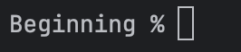
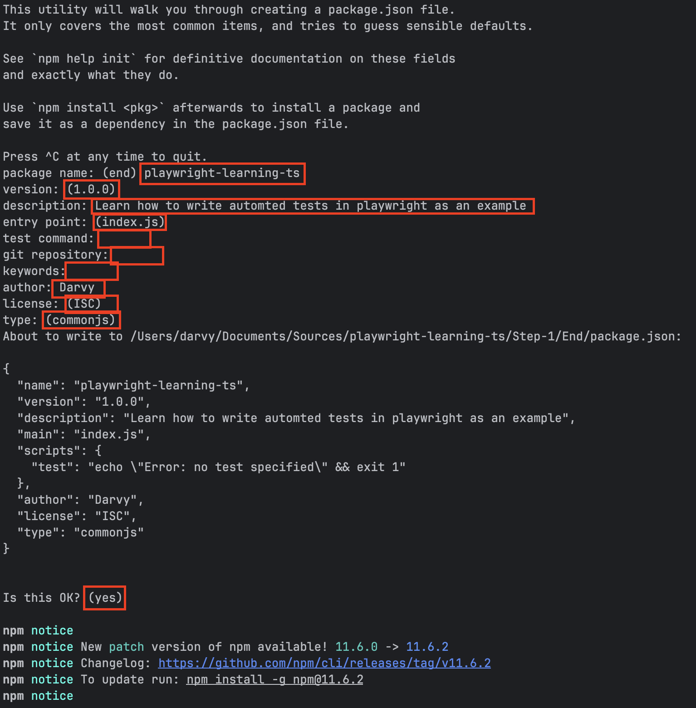
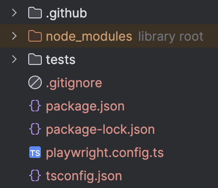
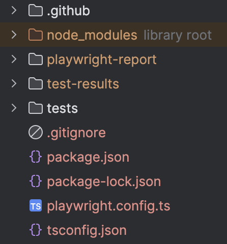
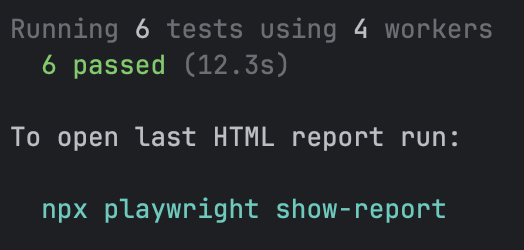

# Create Your Project
## Dependencies
You will need to have the following installed on your machine
- [NodeJS](https://nodejs.org/en/download)
- A package manager. NodeJS comes with `npm` but we strongly recommend using `pnpm` or `yarn` for white box and grey box testing so you can add dependencies and commands independently in your testing project without impacting development code.
- Code Editor like [Webstorm](https://www.jetbrains.com/webstorm/download/) (or any IDE of your preference for Typescript/Javascript).
- [Git](https://git-scm.com/downloads) if you want to follow along with this code in your local, but this is optional.
- Typescript if you choose to (run `npm install -g typescript)` or if you use homebrew, you can also use `brew install typescript`
## Getting Started
Create a folder where you want to start your project. For the purpose of this training, each step will have 2 folders. One marked as `Beginning` and the other as `End`. The idea is that your code should look exactly what the `End` contains after finishing this step.

Notice for this step, the `Beginning` folder is empty! This is because we are starting from scratch!
1. Create a folder called anything you choose. It is best if you don't follow the step structure I have outlined but instead keep everything in 1 folder as each step will build on the last.
2. Go into that folder and open your terminal in your IDE or you can open a terminal in your local machine within that directory. In this case, if I was to run the commands in the `Beginning` directory, my terminal should look like this:

     

    However, as I build this training, I am going to be building in the `End` directory which is the solution you will see at the end. Do not fret! As long as you follow along, it does not matter where the folder is as long as you have already decided where you want it to go.
3. In the terminal, run `npm init`. This will create a node project with a package.json.
4. It will prompt for the following. Enter what you wish! If there is no option you see entered, I just hit enter and moved on. Inputs are shown in red.

    

5. You should see a `package.json` in your solution directory now.
6. Since we are using typescript (and you have installed it already), run `tsc --init` to create the `tsconfig.json` file.
7. Run `npm init playwright@latest`. You can also view the playwright installation instructions from their website [here](https://playwright.dev/docs/intro). Leave all options as default for now.

    Your folder structure should look like this:

    

8. Let's make sure that everything installed correctly! In the terminal, run `npx playwright test`. If all is installed correctly, your folder structure should look like this:

    

    And your output in the terminal should indicate you have passed tests!

    

Congratulations! You should have the foundation of a playwright project in typescript! Move on to the [next step](../Step-2/README.md).
