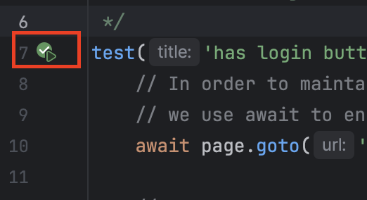
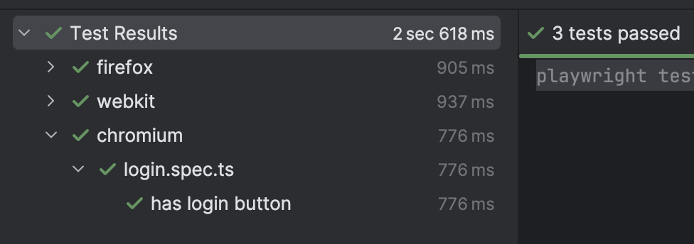
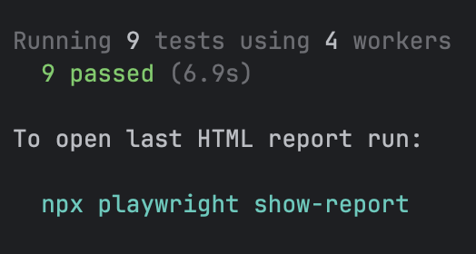

# Creating your first test
## Assumptions
- We will be using the [sauce demo website](https://www.saucedemo.com/v1/) to test our site.
## Folder Structure Breakdown
### .github
This directory contains workflows related to CI pipelines. We will ignore this directory for now.
### tests
We will be writing our tests in this directory (clue is in the name!). You should have an `example.spec.ts` file for now.
### .gitignore
You may or may not have this file. This is how you communicate to `git` what files you want to be ignored when pushing files to a repository. It is **crucial** to **never** check in files that contain passwords. For this example we will, but will remove those values from the repository purely for learning purposes.
### package.json
This file contains the information about the project, dependencies (like playwright), and any custom scripts related to the project.
### package-lock.json
File that contains the dependency tree with specific version of dependencies. We rarely (if ever) will touch this file.
### playwright.config.ts
The bulk of playwright configurations. It should already contain a healthy amount of code that we will break down later.
### tsconfig.json
If you have opened the other files prior to this one, you may notice a lot of... errors... popping up. This is because we didn't build this file properly first.
## Getting Started
1. Open the `tsconfig.json` file and replace with the following code and save
    ```json
    {
        "compilerOptions": {
        "target": "ESNext",
        "module": "commonjs",
        "moduleResolution": "Node",
        "sourceMap": true,
        "outDir": "../tests-out"
        }
    }
   ```
2. Within the root directory of your project, run `npm install` if you haven't yet!
3. Let's write our first test! Create a new test in the `tests/` directory called `login.spec.ts`
4. Open the `login.spec.ts` file and write the following. The explanation is in the comments
    ```ts
    import { test, expect } from '@playwright/test'; // Import playwright library into the test

    /**
     * Title of the test along with the page fixture (more on this later). 
     * This essentially calls the test to run!
     */
    test('has login button', async ({ page }) => {
   
        // In order to maintain thread safety and avoid race conditions,
        // we use await to ensure that the steps don't run out of order!
        await page.goto('https://www.saucedemo.com/v1/'); // go to the webpage
    
        // expect helps test that elements are visible, contain specific text, etc.
        // The getByRole is what we use to find the elements on the page.
        await expect(page.getByRole('button', { name: 'LOGIN' })).toBeVisible();
    });
    ```
5. Let's run the test! If you are using webstorm, you should see a play button right next to the test or you can run `npx playwright test` in the terminal window
    
6. If you ran through webstorm, you should get nice and pretty green
    
    Or if you ran it through the terminal, you should see:
    
7. Let's add our first custom script to `package.json` so we don't have to type `npx playwright test` every time. Let's save a few keystrokes! Open `package.json`
8. There is a section called `scripts` and it shows up like this
    ```json
    ...
    "scripts": {},
    ...
    ```
    The command to run any of the scripts is `npm run <command>` where `<command>` is what we define.
9. Edit the `package.json` script to look like the following
    ```json
    ...
    "scripts": {
      "test": "npx playwright test"
    }
    ...
    ```
    This means that when we run `npm run test` it is telling our project to run `npx playwright test`.

    It may not seem important yet but when we run in CICD, this will be very helpful!
10. Try running `npm run test` and `npx playwright test` and make sure you get the same result.

#### Congratulations! You have written your first test! Things are about to get much more exciting! [Let's write a more meaningful test](../Step-3/README.md)