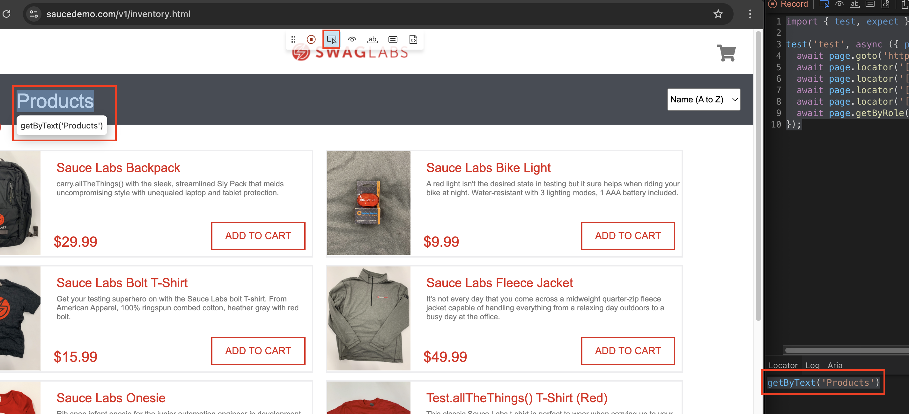

# Meaningful Tests
## Using `codegen`
Before we write a more meaningful login test, lets learn to use the `codegen` tool to help us find the elements.

Documentation from playwright around generating tests can be found [here](https://playwright.dev/docs/codegen-intro).
1. Run the following in the command line or terminal window `npx playwright codegen`
2. You should see a couple of windows. One is the browser itself and the other is code that the tool generates.

    

3. For now, we will be copying code from the right window when selecting from the left. Go ahead perform the actions of:
   1. Enter username (standard_user)
   2. Enter password (secret_sauce)
   3. Click Login
4. You should see the following code in the window on the right
    
    ```ts
    import { test, expect } from '@playwright/test';

    test('test', async ({ page }) => {
      await page.goto('https://www.saucedemo.com/v1/');
      await page.locator('[data-test="username"]').click();
      await page.locator('[data-test="username"]').fill('standard_user');
      await page.locator('[data-test="password"]').click();
      await page.locator('[data-test="password"]').fill('secret_sauce');
      await page.getByRole('button', { name: 'LOGIN' }).click();
    });
    ```
   
5. You can copy and paste this code into your file! Another way to use the `codegen` tool is to simply help you identify the elements on the page. Click on the tool in the left window in the red box and notice how the output changes in the right window in the red box:

    

6. You can copy the value in the right window in the right box and paste it into your code.

Now that we know how to use codegen to help find elements, let's quickly cover some preferences around which methods to use to get page elements.

## `getBy` Element Methods
In the previous section, you can notice that the way it finds the elements is using `page.locator(<some stuff here>)`. This is a preference that I will use the rest of this training and that is to try and use `getByRole` or `getByLabel` because it is a way find elements similar to how a user would.

Many people prefer `getByTestId` and there is not *inherently* wrong with this but the user won't be finding elements on a page by using test-id's. However, this can be helpful if you find elements change frequently and your strategy is to reduce flakiness as much as possible. Just be aware that changing components this frequently to require this could be a code smell!

## Refactoring the test   

1. Open `login.spec.ts` under `tests/`
2. Let's write the test to do the following
   1. Load the site
   2. Check we are logged out
   3. Log in
   4. Check we are logged in
    
    Try writing this by yourself before moving on! Come back to this once you think you have answer.
    
    **NOTE**: Many times, there is almost always more than one way to do something so if you are happy with what you wrote over what I have, that is fine!
3. I changed the `locator` to use `getByRole` instead. Either way, the code should look something like this

    ```ts
    import { test, expect } from '@playwright/test';

    test('has login button', async ({ page }) => {
        // From the previous module
        await page.goto('https://www.saucedemo.com/v1/');
        await expect(page.getByRole('button', { name: 'LOGIN' })).toBeVisible();

        // Log in
        await page.getByRole('textbox', { name: 'Username' }).fill("standard_user"); // Find username input and enter username
        await page.getByRole('textbox', { name: 'Password' }).fill("secret_sauce"); // Find password input and enter password
        await page.getByRole('button', { name: 'LOGIN' }).click(); // Click on Log in

        // Validate we are logged in by ensuring we see log out
        await page.getByRole('button', { name: 'Open Menu' }).click(); // Click hamburger button to open menu
        await expect(page.getByRole('link', { name: 'Logout' })).toBeVisible(); //check button is visible
    });
    ```
   
    Pay close attention to the comments to understand what each step is doing.

When writing good automation, ensure you arrive at the appropriate beginning of the test (known as `arrange`) and validate it as such. Then perform actions that user would to test functionality (known as `act`) and then validate that we have arrived where we expected, data has changed as expected, etc. (known as `assert`). If needed, clean up the environment where appropriate. You want to ensure the environment can run tests indefinitely without any weird behavior like data that didn't get deleted.
## Next Steps
### Problems
- If we added another test to enter a wrong username, we will be forced to copy/paste some code which is generally not ideal. 
- As we navigate through more pages, like the home page, the account page, the checkout page, etc. this code is not descriptive of the page we are on since it just says `page`. In the last test, we went from login to home but no where does it indicate that we traversed that. [Let's fix that next!](../Step-4/README.md)