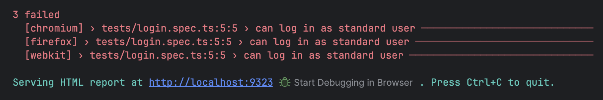
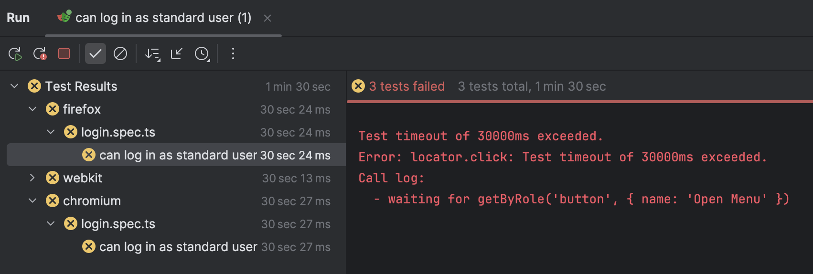
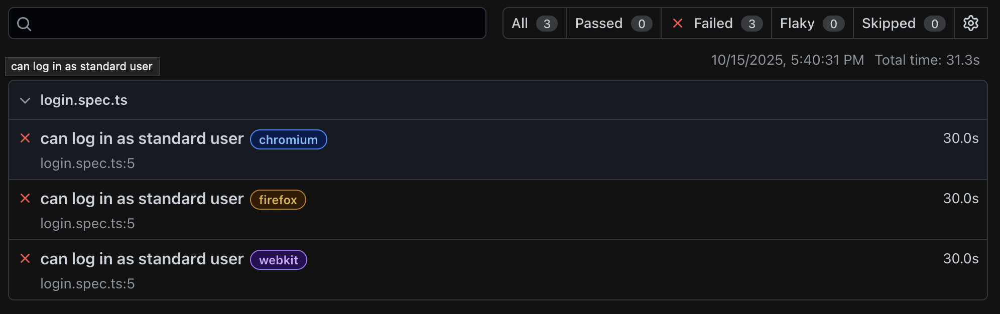
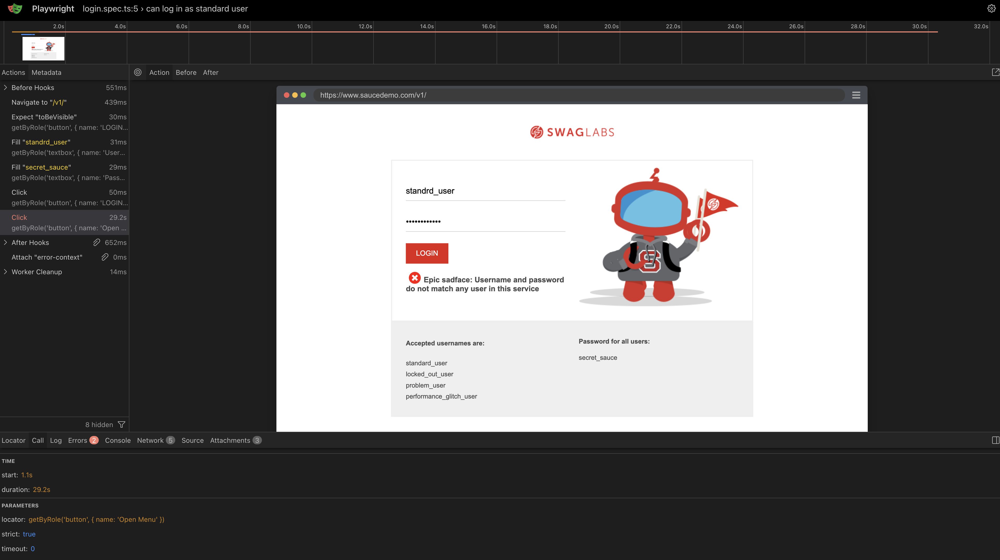
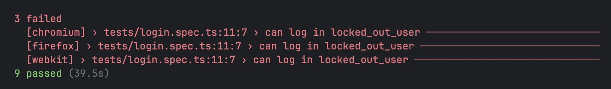

# Expanding Login Tests and Dealing with Errors
Thus far, we should have 9 passing tests but what if we had errors? How do we find out what failed? Thankfully, Playwright reports are a terrific tool to use to triage failures.

Let's purposefully fail a test to see what happens!

## Dealing with Errors

Open your `login.spec.ts` file and change the username to be something incorrect. I will change it to `standrd_user` (oops, a typo!), and then rerun the tests. Oh and before we forget, lets delete the `example.spec.ts` file so we reduce noise.

Now after we run the test using `npm run test`, we will see:



If you run with Webstorm or VS Code, you may see something more like this:



And playwright may have opened a browser with the following information



Using the web browser, you can open a test, and it will give you all kinds of information that will let you know what happened.

While the errors are helpful, they may not be able to provide as much information as we would like.

### Screenshots, Videos, and Traces
In order to aid in our triage efforts when something goes wrong, let's enable screenshots, videos, and traces.

Open the `playwright.config.ts` file.

Search for the word `trace` in the file and set the following variables
```ts
...
trace: 'retain-on-failure',
screenshot: 'only-on-failure',
video: 'retain-on-failure',
...
```
This will ensure that when our tests fail, we get more information. 

Let's run it again and see how the output changes in the web view. You should be able to see screenshot of the failure, the video, and even the trace!

The video and screenshot is straight forward, so let's look at the trace.



On the top timeline, you can hover and see the state of the site as it loads and as playwright performs actions.

On the left pane, you can see all the commands from our code and the result. 

The bottom pane shows us the entire network diagram which can be incredibly useful to see if there are any API errors, responses, etc. that could pertain to any failures.

**Spend some time to navigate and familiarize yourself with the trace screen**

After you have spent a healthy amount of time looking over the trace screen, we can move on.

## Expanding Login Tests
The login screen is fairly easy to test since there isn't much functionality but we will be testing other screens as well later.

We have a few areas to add to our tests:
- All available options for username
- Empty username
- Wrong username
- Empty password
- Wrong password

Since we know all the usernames, we can implement parametrized testing. Playwright has great documentation on how to use it here.

Let's utilize the example provided by playwright to add a list of usernames and passwords to all possible combinations:
```ts
[
  { username: 'standard_user', password: 'secret_sauce' },
  { username: 'locked_out_user', expected: 'secret_sauce' },
  { username: 'problem_user', expected: 'secret_sauce' },
  { username: 'performance_glitch_user', expected: 'secret_sauce' },
]
```
Now let's add the `forEach` where it will cycle through all the usernames and passwords and run the same logic:
```ts
[
  { username: 'standard_user', password: 'secret_sauce' },
  { username: 'locked_out_user', expected: 'secret_sauce' },
  { username: 'problem_user', expected: 'secret_sauce' },
  { username: 'performance_glitch_user', expected: 'secret_sauce' },
].forEach(({username, expected}) => {
  // test code here
});
```
One final thing to change before we run the test is the description for each test must be unique and if we run every single one of these tests without changing the description, playwright will display an error. To make it unique, use the `username` field as part of the description of the test like this:
```ts
test(`can log in ${username}`, async ({page}) => { // Note the use ` intead of ' for the description!
```
Our tests should look something like this:
```ts
[
  { username: 'standard_user', password: 'secret_sauce' },
  { username: 'locked_out_user', password: 'secret_sauce' },
  { username: 'problem_user', password: 'secret_sauce' },
  { username: 'performance_glitch_user', password: 'secret_sauce' },
].forEach(({username, password}) => {
  test(`can log in ${username}`, async ({ page }) => {

    const loginPage = new LoginPage(page);
    const homePage = new HomePage(page);

    await loginPage.goTo();
    await expect(loginPage.loginButton).toBeVisible();

    await loginPage.enterUsername(username); // this is the parameter from the forEach loop
    await loginPage.enterPassword(password); // this is the parameter from the forEach loop
    await loginPage.clickLogin();

    await homePage.openMenu();
    await expect(homePage.logoutButton).toBeVisible();
  });
});
```
Your output should look something like this:



The failure *is* expected! This is because that username is locked out (hence the name) so let's remove that one and add it for a different test.

Let's add a separate test for the locked out user now. First, we can use the trace to see what error appears and add it to our code, or you can use `codegen`, or manually get the error. Add this to the `LoginPage.ts` file:

In the `Locator` section, add:
```ts
readonly loginError: Locator;
```
In the `constructor` section, add: 
```ts
this.loginError = page.locator('[data-test="error"]');
```
We don't need to add a method because the developers were kind enough to reuse the error component so all we need to do is grab the error and then verify the text in it depending on the username and password inputs.

Now that we have added the error getting logic, let's create a new test. Since we have other failed login states we need to test with different errors but similar code, let's parametrize it too. So your code should look something like this:
```ts
[
  { username: 'locked_out_user', password: 'secret_sauce', error: 'Sorry, this user has been locked out.' },
].forEach(({username, password, error}) => {
  test(`unable to log in with error ${error}`, async ({ page }) => {
    const loginPage = new LoginPage(page);

    await loginPage.goTo();
    await expect(loginPage.loginButton).toBeVisible();

    await loginPage.enterUsername(username); // this is the parameter from the forEach loop
    await loginPage.enterPassword(password); // this is the parameter from the forEach loop
    await loginPage.clickLogin();
    await expect(loginPage.loginError).toContainText(error);
  })
});
```
Now let's add all the other errors in the list just as we did with the passing login tests:
```ts
[
  { username: 'locked_out_user', password: 'secret_sauce', error: 'Sorry, this user has been locked out.' },
  { username: '', password: 'secret_sauce', error: 'Username is required' },
  { username: 'locked_out_user', password: '', error: 'Password is required' },
  { username: 'wrong_username', password: 'secret_sauce', error: 'Username and password do not match any user in this service' },
  { username: 'standard_user', password: 'wrong_password', error: 'Username and password do not match any user in this service' },
]
```
Now we can continue after the `forEach` loop. Since the error for the wrong username and password is the same, that meanst he description of the test is no longer unique so we will have to add another differentiating factor into it. We can do something like:
```ts
[
  { username: 'locked_out_user', password: 'secret_sauce', error: 'Sorry, this user has been locked out.' },
  { username: '', password: 'secret_sauce', error: 'Username is required' },
  { username: 'locked_out_user', password: '', error: 'Password is required' },
  { username: 'wrong_username', password: 'secret_sauce', error: 'Username and password do not match any user in this service' },
  { username: 'standard_user', password: 'wrong_password', error: 'Username and password do not match any user in this service' },
].forEach(({username, password, error}) => {
  // test here
});
```
Now we can add the test code with a slight change to the validation step as indicated in the comment below:
```ts
[
  { username: 'locked_out_user', password: 'secret_sauce', error: 'Sorry, this user has been locked out.' },
  { username: '', password: 'secret_sauce', error: 'Username is required' },
  { username: 'locked_out_user', password: '', error: 'Password is required' },
  { username: 'wrong_username', password: 'secret_sauce', error: 'Username and password do not match any user in this service' },
  { username: 'standard_user', password: 'wrong_password', error: 'Username and password do not match any user in this service' },
].forEach(({username, password, error}) => {
  test(`unable to log in with username ${username} and error ${error}`, async ({ page }) => {
    const loginPage = new LoginPage(page);

    await loginPage.goTo();
    await expect(loginPage.loginButton).toBeVisible();

    await loginPage.enterUsername(username);
    await loginPage.enterPassword(password);
    await loginPage.clickLogin();

    await expect(loginPage.loginError).toContainText(error); // Ensure the error message matches the inputs
    await expect(loginPage.loginButton).toBeVisible(); // Ensure we are still in the login page
  })
});
```
It may seem like we have a lot of duplicate code here but since we are validating the login page, it is crucial to leave as is because it helps with documentation. In this case, it is crucial to prioritize readability. These tests can double as documentation on how to test these screens which will be crucial as the workflows get more complex.

#### However, there *are* actions that we need to do to setup the test where rewriting is not needed. This is where fixtures come in. [Let's tackle that next](../Step-6/README.md)!