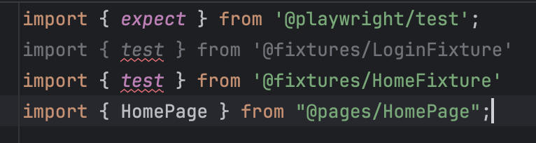

# Implementing Login Fixture
## Fixtures
In summary, fixtures are setup actions to arrange the test. These are not necessarily part of the test itself. For example: if you are testing the checkout process, it is probably understood that you are already logged in and you have items in a cart. Instead of adding all those steps into our automation, we can create a fixture that captures logging in, and another fixture that adds items to the cart so we can proceed with our checkout test. Playwright also has terrific documentation found [here](https://playwright.dev/docs/test-fixtures).

## Adding Fixtures
We will create 2 fixtures, one that adds the `LoginPage` and instantiates it, and another that performs the login functions.

### New Login Page Fixture
Create a directory called `fixtures/` in root.

Now create a fixture called `LoginFixture.ts` within your `fixtures/` directory.

Before we get into too many fixtures, let's make it easy for imports and add the following to the `paths` in the `tsconfig.json`:
```json
...
"@fixtures/*": ["./fixtures/*"]
...
```
After the line where we defined `@pages`.

Now, lets break down the fixture file.

First, we add the imports
```ts
import { test as base } from "@playwright/test"; // We are extending this test
import { LoginPage } from "@pages/LoginPage"; // Need the LoginPage of course!
```
Then we define the `type` of our fixture. Think of it as the functions we will be calling in our tests. For now, we just need the login page.
```ts
type loginFixtures = {
  loginPage: LoginPage
};
```
Finally, we can add the fixture itself! 
```ts
/**
 * Test from playwright is "renamed" as base, we extend it using our type defined previously, 
 * then we define our loginPage function as creating and returning a new page. Simple as that!
 */
export const test = base.extend<loginFixtures>({
  loginPage: async ({ page }, use) => {
    await use(new LoginPage(page));
  }
});
```
## Using Fixtures
To use the fixture in our test, we will first need to fix the imports to import the test from our fixture we just built instead of playwright. We can keep the expect as is for now
```ts
import { expect } from '@playwright/test'; // Keep this as before
import { test } from '@fixtures/LoginFixture'; // Add the test we exported from our fixture
import { HomePage } from "@pages/HomePage"; // Keep this as is for now
```
Then, we add the `loginPage` fixture to our parameter list in our test like this
```ts
// old: test(`can log in ${username}`, async ({ page }) => {
test(`can log in ${username}`, async ({ loginPage, page }) => {
```
We will need to keep the `page` parameter still because we need it for `HomePage` since that does not have a fixture yet.

Now we can remove the line where we instantiated the `LoginPage`. Delete the line:
```ts
const loginPage = new LoginPage(page); // Delete this
```
That line is now being called in the fixture by default! Do this for all the tests and run them to make sure they still pass. If you need help, take a look at our `End/` file [here](./End/tests/login.spec.ts).
### Multiple Fixtures
What about when we have multiple fixtures? In our earlier example, we wanted a fixture to login and another to add items to the cart. So how do we do that? We can use `mergeTests` (you can read more about it [here](https://playwright.dev/docs/test-fixtures#combine-custom-fixtures-from-multiple-modules))

Let's create the home fixture to get rid of that one too. Try creating the fixture in `fixtures` on your own! Then we can move on to adding them to the test.

Once you have the `HomeFixture.ts` created in the fixtures directory, let's add it to the `login.spec.ts` file.

We had already imported the login fixture so let's import the home fixture



Uh oh! We have an error. Since they are both being imported, all we need to do is import them as a different name and then merge them following the instructions from playwright, seen [here](https://playwright.dev/docs/test-fixtures#combine-custom-fixtures-from-multiple-modules).
```ts
import { expect } from '@playwright/test';
import { test as loginFixture} from '@fixtures/LoginFixture'
import { test as homeFixture} from '@fixtures/HomeFixture'
import { HomePage } from "@pages/HomePage";
```
Now, we can merge the fixtures together
```ts
import {expect, mergeTests} from '@playwright/test'; // Add the mergeTests too
import { test as loginFixture} from '@fixtures/LoginFixture'
import { test as homeFixture} from '@fixtures/HomeFixture'
import { HomePage } from "@pages/HomePage";

const test = mergeTests(loginFixture, homeFixture); // Merge fixtures into test
```
One final thing to note before we clean up the tests. Because all of our tests need to start in the login page, we can add the `goto` method to be called in our fixture so we can be sure that we will always have opened the login page. We can do this in the `LoginFixture.ts` as such
```ts
import { test as base } from "@playwright/test"
import { LoginPage } from "@pages/LoginPage";

type loginFixtures = {
  loginPage: LoginPage
};

export const test = base.extend<loginFixtures>({
  loginPage: async ({ page }, use) => {
    const loginPage = new LoginPage(page); // Create page object
    await loginPage.goTo(); // Go to first and foremost
    await use(loginPage);
  }
});
```
Now we can remove any lines in our `login.spec.ts` that contain any instantiation of the home pages, and the `goto` method call!
Any lines that contain the following can be removed:
```ts
const homePage = new HomePage(page);
const loginPage = new LoginPage(page);
await loginPage.goto();
```
We do have to add the page fixtures in the test arguments though to make sure we have access to them. This should look like this, respectively:
```ts
// first test
// old: test(`can log in ${username}`, async ({ loginPage, page }) => {
test(`can log in ${username}`, async ({ loginPage, homePage }) => {
...
// second test
// old: test(`unable to log in with username ${username} and error ${error}`, async ({ loginPage, page }) => {
test(`unable to log in with username ${username} and error ${error}`, async ({ loginPage, homePage }) => {
```
Run the tests to make sure everything is still passing. Take a look at the solution in the `End/` directory if its not passing!

Now that we have all the fixtures to create page objects for us thus far, and we moved the `goto` to the loginfixutre, let's add one more. A fixture that ensures we are on the home page so we don't have to log in anymore as we start testing more and more!

In the `LoginFixture.ts`, we can add a `user` type that includes a username and variable under the existing fixture type
```ts
type loginFixtures = {
  user: { // New
    username: string, // New
    password: string // New
  } // New
  loginPage: LoginPage
  login: void
};
```
We are already extending the fixture with this type so nothing else needs to be added other than setting the default user. You can always override this if you want to.
To add the fixture, you need to add
```ts
export const test = base.extend<loginFixtures>({
  user: [{username: 'standard_user', password: 'secret_sauce'}, {option: true}], // New
  loginPage: async ({ page }, use) => {
    const loginPage = new LoginPage(page);
    await loginPage.goTo();
    await use(loginPage);
  },
...
```
You can override this user by using `test.use`, but we will look at that later.

Next you can write the login fixture! Essentially, we can write the same code that we did for all our login tests within a fixture that we will call `login`. Make sure to add this last as it depends on the `user`, and the `loginPage` already being created
```ts
...
login: async({loginPage, user}, use) => {
  await loginPage.enterUsername(user.username);
  await loginPage.enterPassword(user.password);
  await loginPage.clickLogin();
  await use(); // Nothing in the use because this is void. We don't expect an object out of this fixture.
}
```
#### Note
Why not just use the new `login` fixture in the `login.spec.ts`? Because we want to prioritize readability over reduction of duplicate code in this case. The login test is **supposed** to test the login flow so its key to keep it as readable as possible. Otherwise, the test would look something like:
```ts
test('to use the login fixture instead', async ({login, homePage}) => {
  await homePage.openMenu();
  await expect(homePage.logoutButton).toBeVisible();
});
```
As you can probably see, this is not a very descriptive test. While automation is important on its own, it's also important to make sure it is readable and descriptive. Fixtures are meant to *arrange* the test data or environment so that the test is descriptive of the functionality under test. If the fixture itself is running part of the test, its difficult to understand.

Ultimately, this means that there *may* be duplicate code between the test and fixtures and *this is ok*. Its always good to ask if we can reduce duplicate code but ***not*** if it takes away from readability. That balance is tricky to find but work with your team to come to an agreement.

Great! We have now added fixtures, added exhaustive login validations, and even created a couple of pages objects. 

#### Let's keep expanding and adding our next workflow, adding to cart!